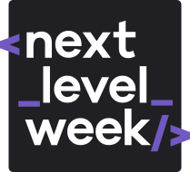

<h1 align="center">
  
</h1>

<h3 align="center">
  Next Level Week by <a href="https://rocketseat.com.br/">Rocketseat</a>
</h3>

  <a href="https://rocketseat.com.br/">
      
      </img>
  </a>
  
  
  
  
  

  <a href="#-about-the-Next-Level-Week">About the NLW</a>&nbsp;&nbsp;&nbsp;|&nbsp;&nbsp;&nbsp;
  <a href="#-technologies">Technologies</a>&nbsp;&nbsp;&nbsp;|&nbsp;&nbsp;&nbsp;
  <a href="#-projects">Projects

## 🚀 About the Next Level Week

>Repo dedicated to NLW by Rocketseat

**NLW** is a practical week with lots of code, insights, lives, challenges, networking and with a single objective: to take you to the **next level**.
Through our method you will learn new tools, learn about new technologies and discover hacks that will boost your career.
An online and completely free event that will help you take the next step in your evolution as a dev.

## 🚀 Technologies

- [Expo](https://expo.io/)
- [Node.js](https://nodejs.org/en/)
- [TypeScript](https://www.typescriptlang.org/)
- [ReactJS](https://reactjs.org/)
- [React Native](https://reactnative.dev/)

## 🚀 Projects

- **NLW #01** - ♻️ [Ecoleta](https://github.com/lucasfdcampos/rocketseat-next-level-week/tree/master/Next-Level-Week01)
- **NLW #02** - 🧑🏻‍🏫 [Proffy](https://github.com/lucasfdcampos/rocketseat-next-level-week/tree/master/Next-Level-Week02)
- **NLW #03** - 🧒🏼 [Happy](https://github.com/lucasfdcampos/rocketseat-next-level-week/tree/master/Next-Level-Week03)
- **NLW #04** - 🤸‍♂️ [Move.it](https://github.com/lucasfdcampos/rocketseat-next-level-week/tree/master/Next-Level-Week04)

---

&nbsp
